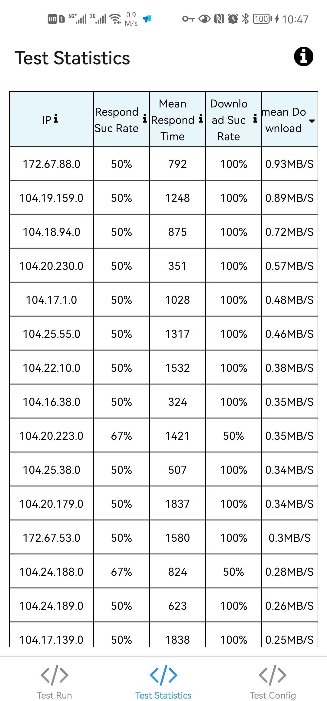

# cloudflare-ip-tester-app

[中文文档](./README.MD)

### Functions

- test cloudflare-ip as many as you want
- generate a history statistics based on your test results.

    
    

### Inspired by

- [CloudflareSpeedTest](https://github.com/XIU2/CloudflareSpeedTest)
- [cloudflare-ip-tester](https://github.com/TulvL/cloudflare-ip-tester)

### Download App

[All versions](https://github.com/xianshenglu/cloudflare-ip-tester-app/releases)

If you're unsure which version to choose then choose `app-universal-release-signed.apk`.

### Donations

### MIT License