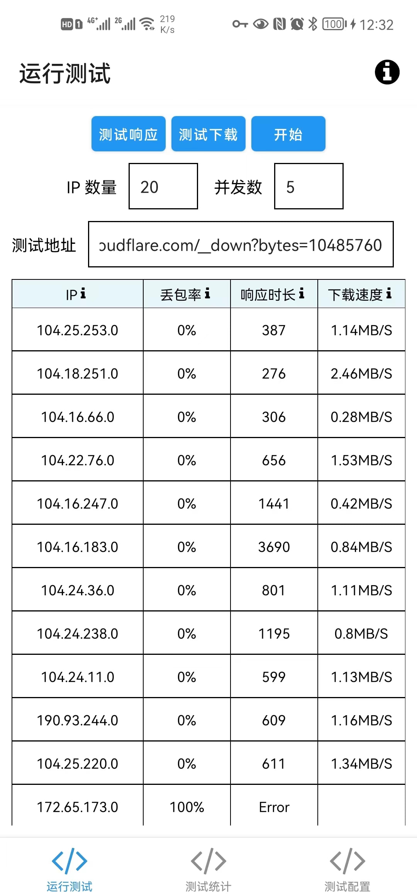
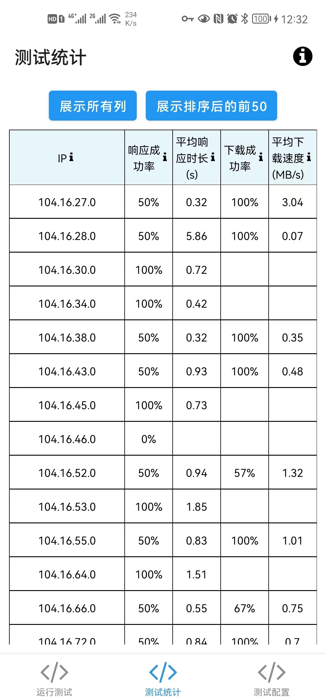
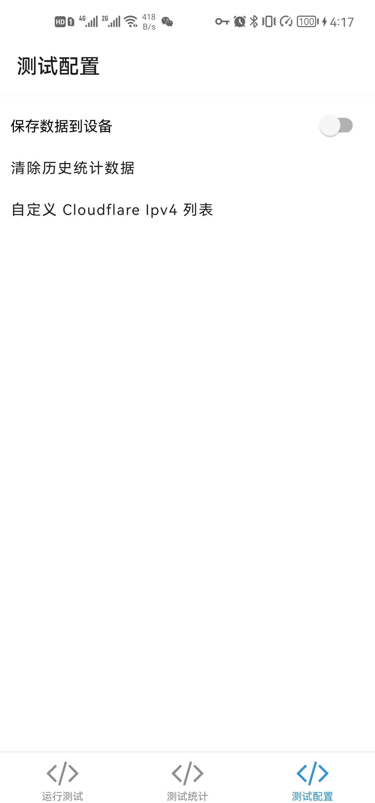

# cloudflare-ip-tester-app

[ENGLISH](./README-EN.MD)

### 功能

- 测试本地网络到 cloudflare 节点的速度
- 根据你的测试结果，生成统计数据，可以排序，得到最好的结果
- 自定义 Cloudflare Ipv4 列表。(如果你想一直用自定义的数据，需要开启"保存数据到设备"。) 你也许可以用它来测试其他 CDN 厂商的节点速度，如果你再修改测试地址的话。

    
    
    

### 灵感来源于

- [CloudflareSpeedTest](https://github.com/XIU2/CloudflareSpeedTest)
- [cloudflare-ip-tester](https://github.com/TulvL/cloudflare-ip-tester)

### 下载 App

[所有版本](https://github.com/xianshenglu/cloudflare-ip-tester-app/releases)

如果不知道下载哪一个，就下通用版 `app-universal-release-signed.apk`.

### 打赏

如果你觉得这个 app 能帮到你，你可以通过 [Paypal](paypal.me/xianshenglu) 或者扫描下面二维码打赏。不论多少都可以鼓励我把这个 App 越做越好。

### MIT License