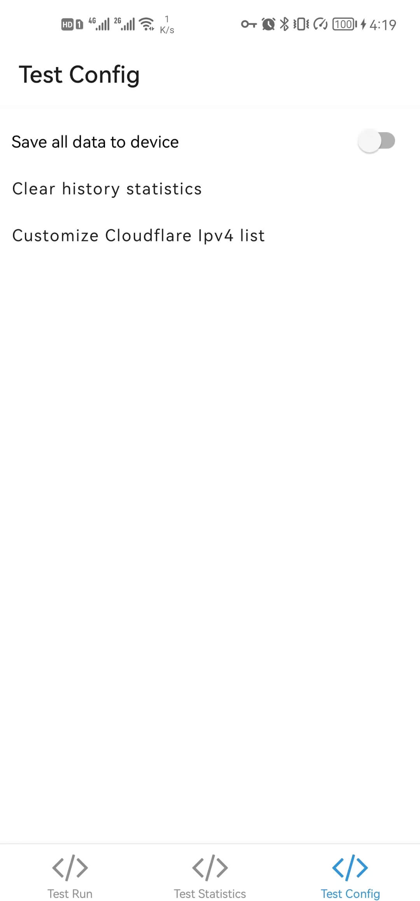

# cloudflare-ip-tester-app

[中文文档](./README.MD)

### Functions

- Test cloudflare-ip as many as you want
- Generate a history statistics based on your test results.
- Customize Cloudflare Ipv4 list. (Need to enable "Save all data to device" if you want to keep the customization all the time.) You might be able to test other cdn vendors' nodes by changing the Ipv4 list and testUrl.

    
    
    

### Inspired by

- [CloudflareSpeedTest](https://github.com/XIU2/CloudflareSpeedTest)
- [cloudflare-ip-tester](https://github.com/TulvL/cloudflare-ip-tester)

### Download App

[All versions](https://github.com/xianshenglu/cloudflare-ip-tester-app/releases)

If you're unsure which version to choose then choose `app-universal-release-signed.apk`.

### Donations

If you think this app can help you, you could donate via [Paypal](https://www.paypal.me/xianshenglu), or scan below QR code to donate via **Alipay** or **WeChat Pay**. Any amount is welcome. It will encourage me to make this app better and better!

### MIT License